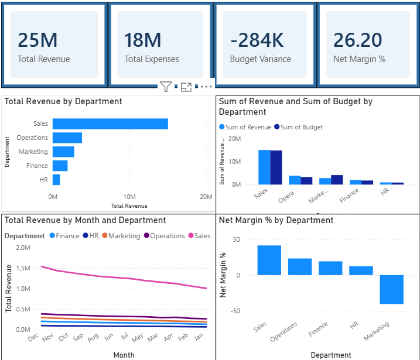

# Financial KPI Executive Dashboard — CFO View

> CFO-level business intelligence dashboard tracking $25M+ revenue across 5 departments with budget vs. actuals, net margin analysis, and monthly trend reporting. Built in Power BI with 16 SQL queries and 4 DAX measures.

---

## Dashboard Preview



---

## Results at a Glance

| Metric | Value |
|---|---|
| Total Revenue Tracked | $25M |
| Total Expenses | $18M |
| Net Margin | 26.20% |
| Budget Variance | -$284K |
| Departments Covered | 5 (Sales, Operations, Marketing, Finance, HR) |
| Time Period | 24 months (2024-2025) |
| SQL Queries Written | 16 |
| DAX Measures Created | 4 |

---

## Business Problem

Finance teams spend hours every month manually pulling numbers from different systems to answer the same executive questions: How are we tracking against budget? Which departments are over or under? What is our growth trend?

This dashboard replaces manual Excel reporting with a single always-current executive view — designed so a CFO can answer any financial performance question in under 30 seconds.

---

## Key Insights from the Dashboard

**1. Sales dominates revenue** — Sales accounts for the majority of $25M total revenue, outperforming all other departments combined.

**2. Marketing is over budget and in negative margin** — The Net Margin % visual clearly shows Marketing operating at -40% margin, the only department in negative territory. Immediate action required.

**3. Budget variance is -$284K company-wide** — Slight underperformance vs budget, driven primarily by Marketing overspend offsetting Sales outperformance.

**4. Revenue trend shows seasonal patterns** — The monthly trend line shows Sales peaking in December and declining through January, consistent with B2B sales cycles.

---

## Dashboard Visuals

| Visual | Type | Business Question Answered |
|---|---|---|
| KPI Cards (4) | Card | What are the top-line numbers right now? |
| Revenue by Department | Horizontal Bar | Which department drives the most revenue? |
| Budget vs Actuals | Clustered Column | Who is over or under budget? |
| Revenue Trend by Month | Line Chart | What is the revenue trajectory over time? |
| Net Margin % by Department | Column Chart | Which departments are profitable? |

---

## DAX Measures

```dax
Total Revenue = SUM(financial_data[Revenue])

Total Expenses = SUM(financial_data[Expenses])

Budget Variance = SUM(financial_data[Revenue]) - SUM(financial_data[Budget])

Net Margin % = DIVIDE(
    SUM(financial_data[Revenue]) - SUM(financial_data[Expenses]),
    SUM(financial_data[Revenue]),
    0
) * 100
```

---

## SQL Queries (16 total)

Key queries in `kpi_queries.sql`:
- Revenue by department and month with company share %
- Annual revenue summary
- Expenses vs budget variance with Over/Under status label
- YoY growth % using LAG window function
- MoM growth % using LAG window function
- Net margin % with margin band classification
- Headcount efficiency (revenue, cost, profit per employee)
- Top 3 departments by profit margin
- Bottom 3 departments by budget overspend
- Rolling 3-month average revenue
- Cumulative YTD revenue vs target gap
- Revenue vs target attainment with status labels
- Company-wide monthly executive snapshot

---

## Tools & Technologies

`Power BI` `DAX` `SQL` `Window Functions` `Financial Modeling`

---

## Files

| File | Description |
|---|---|
| `financial_kpi_dashboard.pbix` | Power BI dashboard file (open in Power BI Desktop) |
| `financial_data.csv` | Synthetic financial dataset (120 rows, 24 months x 5 depts) |
| `kpi_queries.sql` | 16 SQL transformation and analytics queries |
| `dashboard_build_guide.md` | Step by step build instructions |
| `dashboard_screenshot.png` | Dashboard preview image |

---

## How to Open

1. Download `financial_kpi_dashboard.pbix`
2. Open in **Power BI Desktop** (free download from Microsoft)
3. If data doesn't load, click **Transform data** → update the CSV file path to your local location
4. All visuals and DAX measures will render automatically

---

*Part of Haroon Haque Chishti's Business Analytics Portfolio — github.com/haroonhaquechishti*
